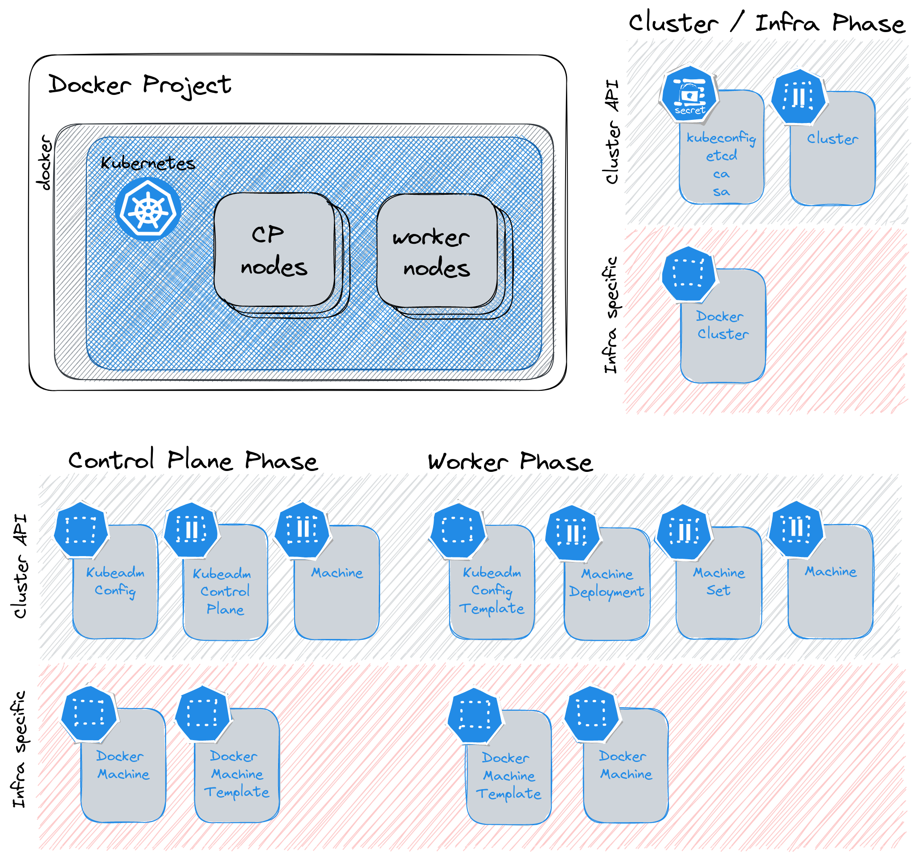
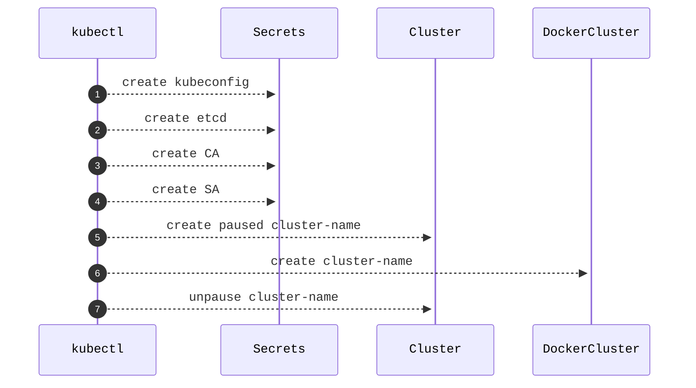
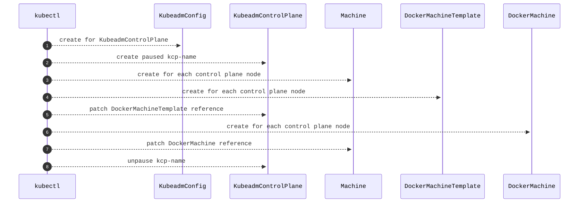
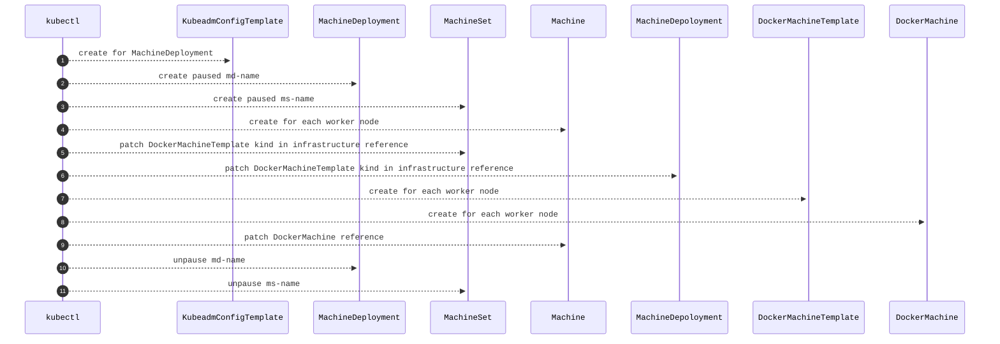

# Docker migration

## Overview

### Phases

#### Cluster

```mermaid
%%{init:{"fontFamily":"monospace", "sequence":{"showSequenceNumbers":true}}}%%
sequenceDiagram
    kubectl-->>+Secrets: create kubeconfig
    kubectl-->>+Secrets: create etcd
    kubectl-->>+Secrets: create CA
    kubectl-->>+Secrets: create SA
    kubectl-->>+Cluster: create paused cluster-name
    kubectl-->>+DockerCluster: create cluster-name
    kubectl-->>+Cluster: unpause cluster-name
```

#### Control Plane

```mermaid
%%{init:{"fontFamily":"monospace", "sequence":{"showSequenceNumbers":true}}}%%
sequenceDiagram
    kubectl-->>+KubeadmConfig: create for KubeadmControlPlane
    kubectl-->>+KubeadmControlPlane: create paused kcp-name
    kubectl-->>+Machine: create for each control plane node
    kubectl-->>+DockerMachineTemplate: create for each control plane node
    kubectl-->>+KubeadmControlPlane: patch DockerMachineTemplate reference
    kubectl-->>+DockerMachine: create for each control plane node
    kubectl-->>+Machine: patch DockerMachine reference
    kubectl-->>+KubeadmControlPlane: unpause kcp-name
```

#### Worker

```mermaid
%%{init:{"fontFamily":"monospace", "sequence":{"showSequenceNumbers":true}}}%%
sequenceDiagram
    kubectl-->>+KubeadmConfigTemplate: create for MachineDeployment
    kubectl-->>+MachineDeployment: create paused md-name
    kubectl-->>+MachineSet: create paused ms-name
    kubectl-->>+Machine: create for each worker node
    kubectl-->>+MachineSet: patch DockerMachineTemplate kind in infrastructure reference
    kubectl-->>+MachineDepoloyment: patch DockerMachineTemplate kind in infrastructure reference
    kubectl-->>+DockerMachineTemplate: create for each worker node
    kubectl-->>+DockerMachine: create for each worker node
    kubectl-->>+Machine: patch DockerMachine reference
    kubectl-->>+MachineDeployment: unpause md-name
    kubectl-->>+MachineSet: unpause ms-name
```