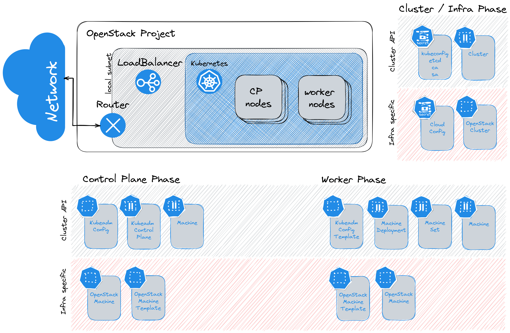
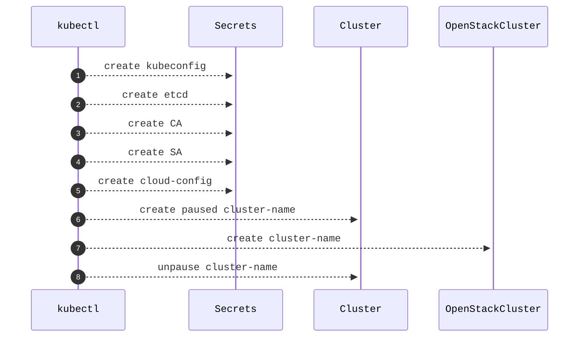
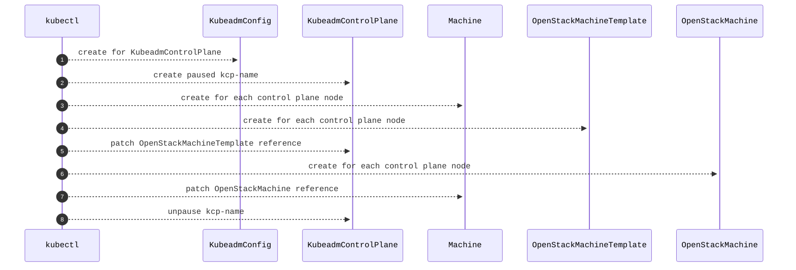
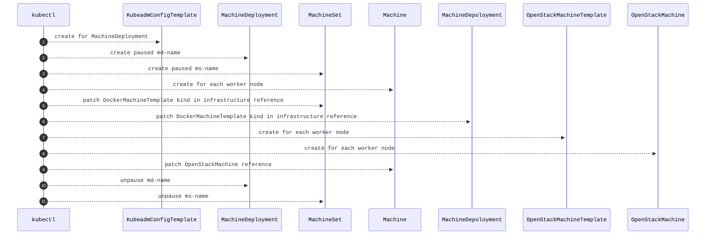

# OpenStack migration

There are some manual steps that must be done during the test of the OpenStack provider.

* Of course an OpenStack Cloud is needed
  * You can use [the local devstack scripts of the CAPO provider](https://github.com/kubernetes-sigs/cluster-api-provider-openstack/pull/1539) which has been used for the tests.
* A SSH key (see env `OPENSTACK_SSH_KEY_NAME` in the [prereqs.sh](prereqs.sh)) must be created in the OpenStack cloud.
* After the first control plane has been provisioned the [OpenStack Cloud Controller Manager](https://github.com/kubernetes/cloud-provider-openstack/tree/master/charts/openstack-cloud-controller-manager) must be deployed (This could be automated as well).

## Overview

### Phases

#### Cluster

#### Control Plane

#### Worker

